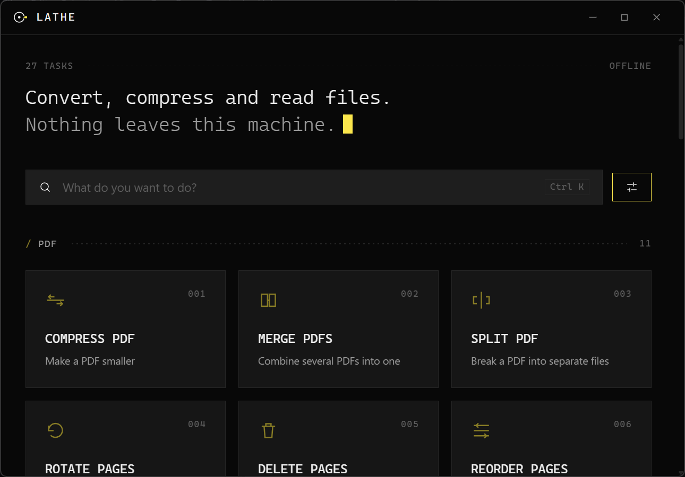
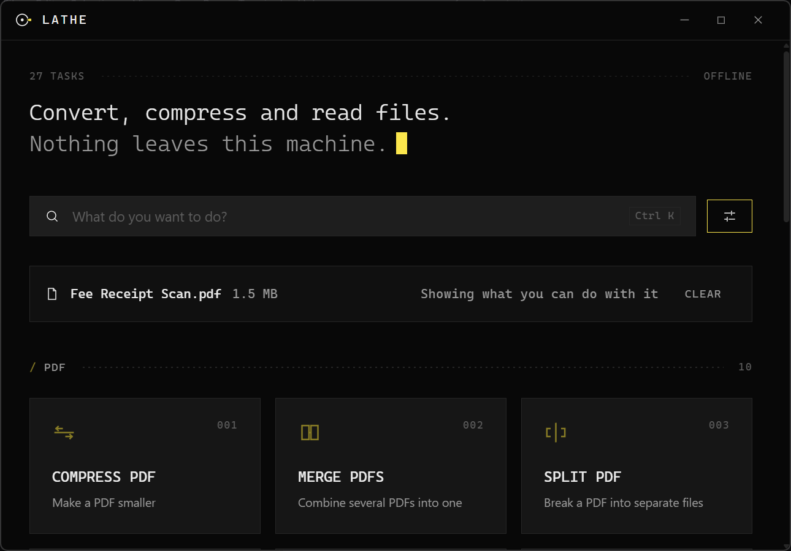
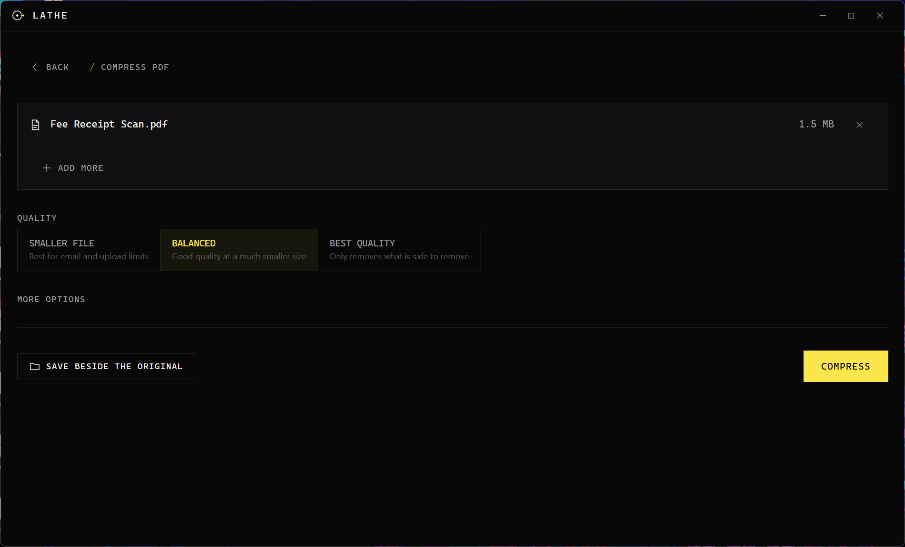
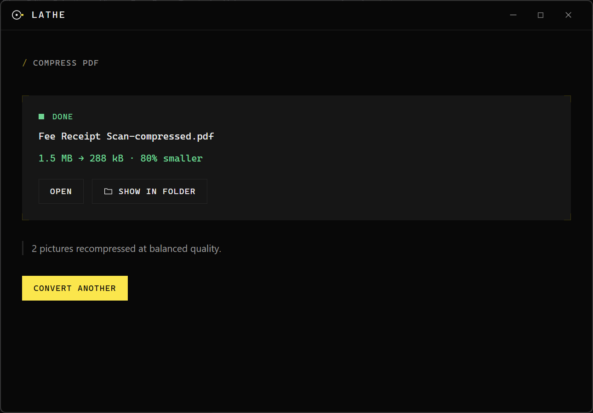
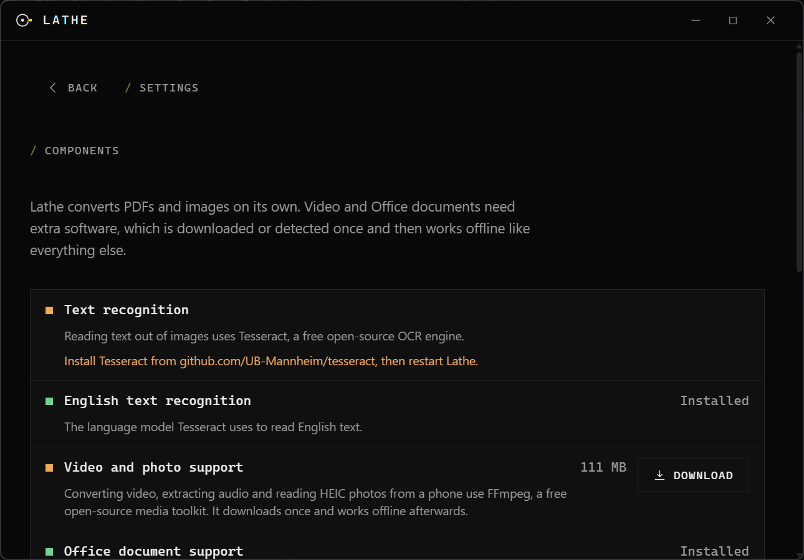

Convert, compress and read files. Offline, free, no upload.

[](https://github.com/nabrahma/Lathe/actions/workflows/ci.yaml)
[](LICENSE)
[](https://github.com/nabrahma/Lathe/releases/latest)

**iLovePDF, but it runs on your computer and your files never leave it.**



## Download

Builds are published on the [releases page](https://github.com/nabrahma/Lathe/releases)
for Windows, macOS and Linux.

There is no installer wizard to sit through and nothing to configure. Download,
open, drag a file in.

## What it does

Twenty-seven tasks, each a card on the home screen rather than a coordinate in a
format matrix.

**PDF.** Compress, merge, split, rotate, delete pages, reorder pages, add a
watermark, add a password, remove a password you know, export pages as images,
build a PDF from images.

**Images.** Convert between JPG, PNG, WEBP, TIFF, BMP and GIF; compress with a
quality setting; resize by pixels or by a preset; crop to a shape.

**Text.** Read the words out of a photo or a scan, pull the text out of a PDF,
turn a scanned PDF into one you can search and copy from.

**Documents.** PDF to Word, Word and Excel and PowerPoint to PDF, and the
usual interchange between Office and OpenDocument formats.

**Video and audio.** Convert and compress video, pull the audio out of a
clip, convert between audio formats, make a GIF.

Drag a file onto the home screen and the grid filters itself to what you can do
with that file. Drop a photo and you see Convert, Compress, Resize, Extract
text, Images to PDF. You never have to know which category anything is in.



Then the task screen: the file already attached, at most three options with
sensible defaults, and one button carrying a verb.





## Why not just use an online converter?

Because the file you are converting is usually a document with your name,
address or ID number on it, and an online converter means uploading it to a
server belonging to someone you have never heard of.

Beyond that: no size limit, no watermark, no daily quota, no account, and it
works with the network unplugged.

## How it works

Lathe is a desktop interface over pdfcpu, Tesseract, FFmpeg and LibreOffice. It
did not reinvent any of them, and it is not going to out-implement FFmpeg.

What Lathe contributes is the part those tools do not: an interface that gets
out of your way, a job pipeline that will not damage your file, packaging that
installs in seconds and grows only when you ask it to, and a guarantee that
nothing you convert ever leaves the machine.

The engineering that actually took the time was the dependency tiering
([BUNDLING.md](docs/BUNDLING.md)), the cross-platform process and filesystem
work ([DISCOVERIES.md](docs/DISCOVERIES.md)), and making a webview-based window
stop feeling like a web page.

## Does it actually make things smaller?

Compressing a PDF re-encodes the pictures inside it, which is what shrinks a
scan. A lossless optimiser pass alone would report a scanned document as
"already as small as it can get", which is true of its structure and useless to
the person holding a 14 MB file and a 2 MB upload limit.

Measured on the sample scan from `scripts/demofiles`:

| Quality | Result |
|---|---|
| Smaller file | 1.5 MB to 197 kB, 87% smaller |
| Balanced | 1.5 MB to 288 kB, 80% smaller |
| Best quality | 1.5 MB to 493 kB, 66% smaller |

A PDF that is already tight comes back untouched with a note saying so, rather
than being returned slightly larger.

Those figures are what a bare install produces. If Ghostscript happens to be
installed, Lathe also runs the file through it and keeps whichever result is
smaller, which helps most at the best-quality setting because Ghostscript can
lower a scan's resolution and the built-in path cannot. Nothing prompts you to
install it and no task requires it. The reasoning is in
[DECISIONS.md](docs/DECISIONS.md) D7, and the limit it lifts in
[KNOWN_GAPS.md](docs/KNOWN_GAPS.md).

## Install size

| | Size | When |
|---|---:|---|
| **Lathe itself** | **18.1 MB** | The download |
| Video and photo support (FFmpeg) | 111 MB | First video task, or the first HEIC photo |
| Text recognition (Tesseract) | detected, not downloaded | First OCR task |
| Office documents (LibreOffice) | detected, not downloaded | First Word or Excel task |

PDF and image work needs none of that: it is compiled into the binary and
available the moment Lathe opens. Anything heavier says what it needs and how
big it is *before* you commit, then works offline afterwards.



Tesseract and LibreOffice are detected rather than downloaded. Neither
publishes a portable, checksummed archive for all three platforms, and
installing an unverified binary onto someone's machine would defeat the point
of verifying downloads at all. If Lathe cannot find them it says exactly what
to install. See [BUNDLING.md](docs/BUNDLING.md).

Measured, not estimated: [docs/evidence/binary-size.md](docs/evidence/binary-size.md).

## Speed

| | Measured | Target |
|---|---:|---:|
| Cold start | 479 ms | under 2 s |
| Idle memory | 31.8 MB | n/a |

Median of five cold launches on Windows 11, Ryzen 7 6800HS. Method and raw
numbers in [docs/evidence/startup-windows.md](docs/evidence/startup-windows.md).
Reproduce them yourself; do not take the table's word for it.

## OCR accuracy

Character-level accuracy against committed ground truth, from
[docs/evidence/ocr-accuracy.json](docs/evidence/ocr-accuracy.json):

| Input | Accuracy |
|---|---:|
| Clean scan | 100% |
| Skewed, unevenly lit, noisy | 100% |
| Hard-edged shadow across the page | 99.6% |
| A third of the resolution | 99.8% |

**Read that table with the caveat it deserves.** The corpus is rendered from
digital text and then degraded programmatically, which is an easier target than
a photograph of physically printed paper, so real-world accuracy on a
crumpled receipt will be lower. What the benchmark is genuinely good for is catching a
regression in the preprocessing chain, and CI fails if any figure drops by more
than two points.

The preprocessing is why the degraded sets score close to the clean one. Lathe
flattens the lighting, deskews, trims the dark border from a page photographed
on a desk, denoises, upscales below roughly 300 DPI, and only then binarises,
using Sauvola's method: a threshold chosen for every pixel from its own
surroundings rather than one chosen for the whole page.

Those last two steps are the ones that were measured rather than assumed. On a
page with a hard-edged shadow across it, the kind cast by your own hand or by
the gutter of a bound book, a single threshold for the page reads 37% of the
text and a local one reads 99%. Flattening the lighting first, before the
deskew and the border trim rather than after them, is worth a further fifteen
points, because both of those steps judge a page by how dark its rows are and a
shadow makes them answer about the lighting instead. The comparison is
[internal/engine/ocrengine/binarize_test.go](internal/engine/ocrengine/binarize_test.go)
and it fails if either choice is undone.

## Privacy

> Lathe never uploads your files. There is no server, no account and no
> telemetry of any kind.

You can check this in ten seconds: disconnect from the internet and everything
except a one-time component download works exactly the same.

It is also enforced in the code rather than promised in a document. No package
outside `internal/deps` and `internal/update` may so much as *import* network
code, and the whole conversion suite runs in CI with outbound access blocked.
Both are tests, not policies: [test/isolation](test/isolation).

Full detail in [PRIVACY.md](docs/PRIVACY.md).

## Limitations

Stated plainly, because you will find them anyway.

- **PDF to Word is best-effort.** LibreOffice does the conversion. Simple pages
  come through well; multi-column layouts with floating figures do not. Lathe
  says so on screen before the conversion, not after.
- **HEIC needs the video component.** No pure-Go HEIC decoder is worth
  depending on, so the first HEIC photo prompts for the FFmpeg download.
- **Exporting PDF pages as images works on scans, not on vector pages.** Lathe
  extracts the embedded page images rather than rasterising, so a page drawn as
  text and shapes has nothing to extract. It says that instead of failing.
- **The Linux window looks different.** Windows and macOS get custom chrome;
  Linux keeps the window manager's own title bar, because Linux window managers
  vary too much to own that surface safely in a first release.
- **Windows builds are not signed yet.** SmartScreen will show a blue warning:
  click **More info**, then **Run anyway**. A certificate costs a few hundred
  dollars a year and will be bought when the project has enough traction to
  justify it. Saying nothing about this would just produce confused users.
- **No PDF text editing, no mobile app, no AI features.** Deliberate, with
  reasons: [KNOWN_GAPS.md](docs/KNOWN_GAPS.md).

## Command line

The same task registry, headless:

```
lathe pdf-compress report.pdf --quality medium
lathe pdf-merge a.pdf b.pdf c.pdf -o merged.pdf
lathe image-convert photo.png --format webp
lathe text-from-image scan.jpg --lang eng+hin -o text.txt
lathe --list-tasks
```

Output paths go to stdout, one per line; progress and notes go to stderr, so
piping stdout gives a clean list of results.

## Building it yourself

```
make deps      # Go modules and npm packages
make check     # format, vet, import boundaries, tests
make corpus    # regenerate the golden test corpus
make build     # the desktop app
make build-cli # the headless binary
```

Needs Go 1.25+, Node 22+ and, on Linux, `libgtk-3-dev` and
`libwebkit2gtk-4.1-dev`. `scripts/linux-deps.sh` installs those across
Debian, Fedora and Arch.

`build/docker/test.Dockerfile` carries Tesseract, FFmpeg and Ghostscript, so the
OCR, media and compression suites run on a machine that has none of them:

```
docker build -f build/docker/test.Dockerfile -t lathe-test .
docker run --rm -v "$PWD:/src" -w /src lathe-test go test ./...
```

## Contributing

Adding a task means adding one entry to the registry and teaching one engine to
handle it; nothing else changes, and both the interface and the CLI pick it up
automatically. [ADDING_A_TASK.md](docs/ADDING_A_TASK.md) walks through it.

Two rules are not negotiable, and both are enforced by tests:

1. **No task ever modifies an input file.** Every output is written to a temp
   file beside its destination and atomically renamed.
2. **No engine error reaches a user untranslated.** "exit status 137" is not a
   message.

## Licence

Lathe is [AGPL-3.0](LICENSE). The reasoning, including why not MIT, is recorded
in [DECISIONS.md](docs/DECISIONS.md) as D4. Component licences are catalogued in
[LICENSES.md](docs/LICENSES.md).
